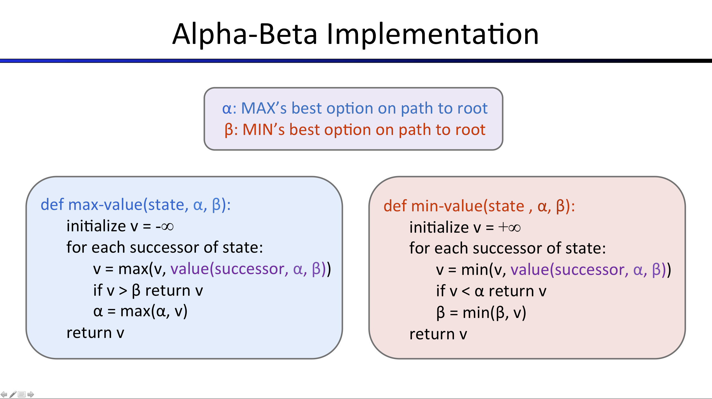

# VSCode Configuration 
1. Install python 2.7 
2. Select Interpreter
    - Press CTRL-SHIFT-P
    - Type "Python: Select Interpreter"
    - Select Python 2.7.x
3. Configure pylance in user settings. Pylance does not support Python 2 and will generate excessive linting error and warning messages.
    - Press CTRL-SHIFT-P
    - Type "Preferences: Open User Settings"
    - Add line to settings.JSON (replace path with your path):
    ```json
    "python.analysis.ignore": ["c:\\Users\\ahuan\\Documents\\Repositories\\cs3310-project\\**"]
    ```
4. Open Terminal (CTRL+`) (WSL recommended for Windows)
    - Activate appropriate conda environment if applicable
    - Install tkinter
    - Ubuntu/WSL:
    ```
    sudo apt install python-tkinter
    ```
    - Run pacman.py with Python 2 to verify.

# Search

[comment]: # (use [x] to check boxes)
Berkeley website: http://ai.berkeley.edu/search.html
- [x] Implement A* search algorithm.
- [x] Implement custom heuristic
## A* Search
Implement A* graph search in the empty function astarsearch in search.py. a* takes a heuristic function as an argument. Heuristics take two arguments: a state in the search problem (the main argument), and the problem itself (for reference information). The nullHeuristic heuristic function in search.py is a trivial example.

You can test your A* implementation on the original problem of finding a path through a maze to a fixed position using the Manhattan distance heuristic (implemented already as manhattanHeuristic in searchAgents.py).
```bash
python pacman.py -l bigMaze -z .5 -p SearchAgent -a fn=astar,heuristic=manhattanHeuristic
```
You should see that A* finds the optimal solution slightly faster than uniform cost search (about 549 vs. 620 search nodes expanded in our implementation, but ties in priority may make your numbers differ slightly). What happens on openMaze for the various search strategies?

- Commands to run for A* Search competition (custom heuristic function in search.py):
```bash
python pacman.py -l bigMaze -z .5 -p SearchAgent -a fn=astar,heuristic=ourHeuristic
```
# Multi-Agent
Berkeley website: http://ai.berkeley.edu/multiagent.html 
- [ ] Implement Improved Reflex Agent
- [ ] Implement Minimax
- [ ] Implement Alpha-Beta Pruning
- [ ] Implement Expectimax
- [ ] Implement Heuristic Evaluation Function

## Reflex Agent
Improve the ReflexAgent in multiAgents.py to play respectably. The provided reflex agent code provides some helpful examples of methods that query the GameState for information. A capable reflex agent will have to consider both food locations and ghost locations to perform well. Your agent should easily and reliably clear the testClassic layout:
```bash
python pacman.py -p ReflexAgent -l testClassic
```
Try out your reflex agent on the default mediumClassic layout with one ghost or two (and animation off to speed up the display):
```bash
python pacman.py --frameTime 0 -p ReflexAgent -k 1
```
```bash
python pacman.py --frameTime 0 -p ReflexAgent -k 2
```
How does your agent fare? It will likely often die with 2 ghosts on the default board, unless your evaluation function is quite good.

Note: As features, try the reciprocal of important values (such as distance to food) rather than just the values themselves.

Note: The evaluation function you're writing is evaluating state-action pairs; in later parts of the project, you'll be evaluating states.

Options: Default ghosts are random; you can also play for fun with slightly smarter directional ghosts using -g DirectionalGhost. If the randomness is preventing you from telling whether your agent is improving, you can use -f to run with a fixed random seed (same random choices every game). You can also play multiple games in a row with -n. Turn off graphics with -q to run lots of games quickly.

Grading: we will run your agent on the openClassic layout 10 times. You will receive 0 points if your agent times out, or never wins. You will receive 1 point if your agent wins at least 5 times, or 2 points if your agent wins all 10 games. You will receive an addition 1 point if your agent's average score is greater than 500, or 2 points if it is greater than 1000. You can try your agent out under these conditions with

```bash
python autograder.py -q q1
```
To run it without graphics, use:
```bash
python autograder.py -q q1 --no-graphics
```
Don't spend too much time on this question, though, as the meat of the project lies ahead.

## Minimax
Now you will write an adversarial search agent in the provided MinimaxAgent class stub in multiAgents.py. Your minimax agent should work with any number of ghosts, so you'll have to write an algorithm that is slightly more general than what you've previously seen in lecture. In particular, your minimax tree will have multiple min layers (one for each ghost) for every max layer.

Your code should also expand the game tree to an arbitrary depth. Score the leaves of your minimax tree with the supplied self.evaluationFunction, which defaults to scoreEvaluationFunction. MinimaxAgent extends MultiAgentSearchAgent, which gives access to self.depth and self.evaluationFunction. Make sure your minimax code makes reference to these two variables where appropriate as these variables are populated in response to command line options.

Important: A single search ply is considered to be one Pacman move and all the ghosts' responses, so depth 2 search will involve Pacman and each ghost moving two times.

Grading: We will be checking your code to determine whether it explores the correct number of game states. This is the only way reliable way to detect some very subtle bugs in implementations of minimax. As a result, the autograder will be very picky about how many times you call GameState.generateSuccessor. If you call it any more or less than necessary, the autograder will complain. To test and debug your code, run

```bash
python autograder.py -q q2
```
This will show what your algorithm does on a number of small trees, as well as a pacman game. To run it without graphics, use:

```bash
python autograder.py -q q2 --no-graphics
```
### Hints and Observations

- The correct implementation of minimax will lead to Pacman losing the game in some tests. This is not a problem: as it is correct behaviour, it will pass the tests.
- The evaluation function for the pacman test in this part is already written (self.evaluationFunction). You shouldn't change this function, but recognize that now we're evaluating *states* rather than actions, as we were for the reflex agent. Look-ahead agents evaluate future states whereas reflex agents evaluate actions from the current state.
- The minimax values of the initial state in the minimaxClassic layout are 9, 8, 7, -492 for depths 1, 2, 3 and 4 respectively. Note that your minimax agent will often win (665/1000 games for us) despite the dire prediction of depth 4 minimax.
```
python pacman.py -p MinimaxAgent -l minimaxClassic -a depth=4
```
- Pacman is always agent 0, and the agents move in order of increasing agent index.
- All states in minimax should be GameStates, either passed in to getAction or generated via GameState.generateSuccessor. In this project, you will not be abstracting to simplified states.
- On larger boards such as openClassic and mediumClassic (the default), you'll find Pacman to be good at not dying, but quite bad at winning. He'll often thrash around without making progress. He might even thrash around right next to a dot without eating it because he doesn't know where he'd go after eating that dot. Don't worry if you see this behavior, question 5 will clean up all of these issues.
- When Pacman believes that his death is unavoidable, he will try to end the game as soon as possible because of the constant penalty for living. Sometimes, this is the wrong thing to do with random ghosts, but minimax agents always assume the worst:
```bash
python pacman.py -p MinimaxAgent -l trappedClassic -a depth=3
```
Make sure you understand why Pacman rushes the closest ghost in this case.

## Alpha-Beta Pruning
Make a new agent that uses alpha-beta pruning to more efficiently explore the minimax tree, in AlphaBetaAgent. Again, your algorithm will be slightly more general than the pseudocode from lecture, so part of the challenge is to extend the alpha-beta pruning logic appropriately to multiple minimizer agents.

You should see a speed-up (perhaps depth 3 alpha-beta will run as fast as depth 2 minimax). Ideally, depth 3 on smallClassic should run in just a few seconds per move or faster.

```bash
python pacman.py -p AlphaBetaAgent -a depth=3 -l smallClassic
```
The AlphaBetaAgent minimax values should be identical to the MinimaxAgent minimax values, although the actions it selects can vary because of different tie-breaking behavior. Again, the minimax values of the initial state in the minimaxClassic layout are 9, 8, 7 and -492 for depths 1, 2, 3 and 4 respectively.

Grading: Because we check your code to determine whether it explores the correct number of states, it is important that you perform alpha-beta pruning without reordering children. In other words, successor states should always be processed in the order returned by GameState.getLegalActions. Again, do not call GameState.generateSuccessor more than necessary.

You must not prune on equality in order to match the set of states explored by our autograder. (Indeed, alternatively, but incompatible with our autograder, would be to also allow for pruning on equality and invoke alpha-beta once on each child of the root node, but this will not match the autograder.)

The pseudo-code below represents the algorithm you should implement for this question.



To test and debug your code, run

```bash
python autograder.py -q q3
```
This will show what your algorithm does on a number of small trees, as well as a pacman game. To run it without graphics, use:

```bash
python autograder.py -q q3 --no-graphics
```
The correct implementation of alpha-beta pruning will lead to Pacman losing some of the tests. This is not a problem: as it is correct behaviour, it will pass the tests.

## Expectimax

Minimax and alpha-beta are great, but they both assume that you are playing against an adversary who makes optimal decisions. As anyone who has ever won tic-tac-toe can tell you, this is not always the case. In this question you will implement the ExpectimaxAgent, which is useful for modeling probabilistic behavior of agents who may make suboptimal choices.

As with the search and constraint satisfaction problems covered so far in this class, the beauty of these algorithms is their general applicability. To expedite your own development, we've supplied some test cases based on generic trees. You can debug your implementation on small the game trees using the command:

```bash
python autograder.py -q q4
```
Debugging on these small and manageable test cases is recommended and will help you to find bugs quickly. Make sure when you compute your averages that you use floats. Integer division in Python truncates, so that 1/2 = 0, unlike the case with floats where 1.0/2.0 = 0.5.

Once your algorithm is working on small trees, you can observe its success in Pacman. Random ghosts are of course not optimal minimax agents, and so modeling them with minimax search may not be appropriate. ExpectimaxAgent, will no longer take the min over all ghost actions, but the expectation according to your agent's model of how the ghosts act. To simplify your code, assume you will only be running against an adversary which chooses amongst their getLegalActions uniformly at random.

To see how the ExpectimaxAgent behaves in Pacman, run:

```bash
python pacman.py -p ExpectimaxAgent -l minimaxClassic -a depth=3
```
You should now observe a more cavalier approach in close quarters with ghosts. In particular, if Pacman perceives that he could be trapped but might escape to grab a few more pieces of food, he'll at least try. Investigate the results of these two scenarios:

```bash
python pacman.py -p AlphaBetaAgent -l trappedClassic -a depth=3 -q -n 10
```
```bash
python pacman.py -p ExpectimaxAgent -l trappedClassic -a depth=3 -q -n 10
```
You should find that your ExpectimaxAgent wins about half the time, while your AlphaBetaAgent always loses. Make sure you understand why the behavior here differs from the minimax case.

The correct implementation of expectimax will lead to Pacman losing some of the tests. This is not a problem: as it is correct behaviour, it will pass the tests.

## Evaluation Function
Write a better evaluation function for pacman in the provided function betterEvaluationFunction. The evaluation function should evaluate states, rather than actions like your reflex agent evaluation function did. You may use any tools at your disposal for evaluation, including your search code from the last project. With depth 2 search, your evaluation function should clear the smallClassic layout with one random ghost more than half the time and still run at a reasonable rate (to get full credit, Pacman should be averaging around 1000 points when he's winning).

```bash
python autograder.py -q q5
```
Grading: the autograder will run your agent on the smallClassic layout 10 times. We will assign points to your evaluation function in the following way:

- If you win at least once without timing out the autograder, you receive 1 points. Any agent not satisfying these criteria will receive 0 points.
- +1 for winning at least 5 times, +2 for winning all 10 times
- +1 for an average score of at least 500, +2 for an average score of at least 1000 (including scores on lost games)
- +1 if your games take on average less than 30 seconds on the autograder machine. The autograder is run on EC2, so this machine will have a fair amount of resources, but your personal computer could be far less performant (netbooks) or far more performant (gaming rigs).
- The additional points for average score and computation time will only be awarded if you win at least 5 times.
### Hints and Observations
- As for your reflex agent evaluation function, you may want to use the reciprocal of important values (such as distance to food) rather than the values themselves.
- One way you might want to write your evaluation function is to use a linear combination of features. That is, compute values for features about the state that you think are important, and then combine those features by multiplying them by different values and adding the results together. You might decide what to multiply each feature by based on how important you think it is.